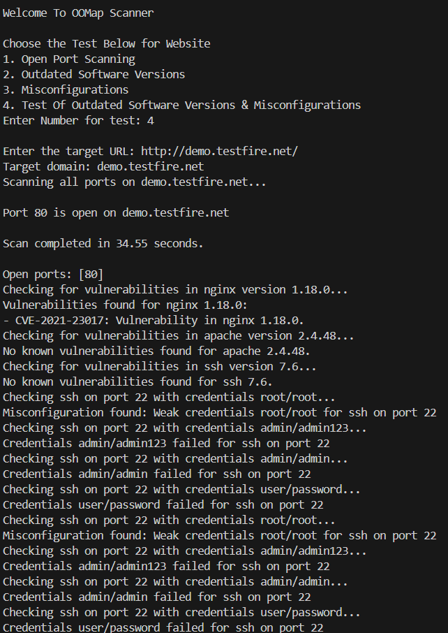

# OOMAP - Port Scanner and Vulnerability Checker

**Name:** OM HASE  
**Company:** CODTECH IT SOLUTIONS  
**ID:** CT8CSEH1649  
**Domain:** CYBER SECURITY & ETHICAL HACKING  
**Duration:** July To September 2024  
**Mentor:** NEELA SANTHOSH KUMAR  

## **Overview Of Project**

The "OOMAP" tool is a comprehensive port scanning and vulnerability checking utility. It enables users to:

- **Scan for open ports** on a target server.
- **Retrieve service banners** from open ports.
- **Check for known vulnerabilities** based on service banners using a mock CVE database.
- **Identify common misconfigurations** in services.
- **Assess weak credentials** for various services to identify potential security risks.

## **Features**

- **Port Scanning:** Detects open ports on the target server.
- **Vulnerability Checking:** Identifies known vulnerabilities using a mock CVE database.
- **Misconfiguration Detection:** Checks for common misconfigurations in detected services.
- **Weak Credential Testing:** Attempts to log in with common weak credentials to find security weaknesses.

## **Output Images**

- **Port Scanning:**

 

- **Combined Test:**



## **Installation**

Ensure you have Python 3.6 or higher installed. Clone this repository and install the required packages:

```bash
git clone https://github.com/OM-HASE/CODTECH-TASK-1.git
```

## **Usage**

To run the tool, execute the script:

```bash
python Task-1-Vulnerability-Scanning-Tool-OOMAP.py
```

**Interactive Menu**
When running the script, you will be prompted to:

- ****Open Port Scanning**:** Scans all ports on the target.
- **Outdated Software Versions:** Checks for vulnerabilities in detected software versions.
- **Misconfigurations:** Identifies common misconfigurations.
- **Combined Test:** Performs both outdated software checks and misconfiguration detection.
  
Enter the target URL, and the tool will execute the selected tests and display the results accordingly.

## **Code Overview**

**Core Functions**

- **scan(target):** Scans all ports on the target and returns open ports.
- **scan_port(target, port):** Checks an individual port for its status.
- **get_banner(target, port):** Retrieves the service banner from an open port.
- **check_for_vulnerabilities(banner):** Checks for known vulnerabilities based on the service banner.
- **check_for_misconfigurations(target, port, banner):** Identifies common misconfigurations based on the service banner.
- **check_weak_credentials(target, port, service):** Tests common weak credentials for various services.

## **Mock Functions**
- **mock_nvdlib_searchCVE(cpeName):** Simulates CVE searches for testing purposes.
- **mock_try_login(target, port, service, username, password):** Simulates login attempts with predefined credentials.

## **Testing**
You can test the functionality of the tool using the **'test()'** function included in the script. This function verifies:

- **Vulnerabilities:** Based on predefined test banners.
- **Misconfigurations:** Using mock test banners.
- **Weak Credentials:** For various services.

## **Contributing**
Contributions are welcome! Feel free to open issues, submit pull requests, or suggest improvements.

## **Contact Information**
For any questions or issues, please contact OM HASE at omhase9955@gmail.com.
